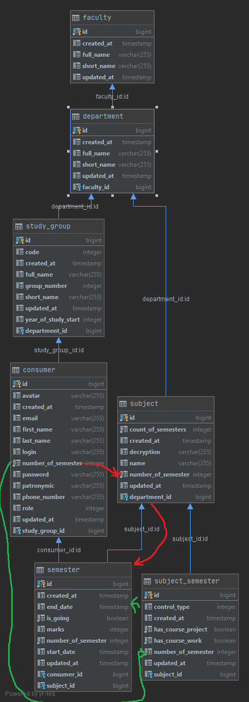
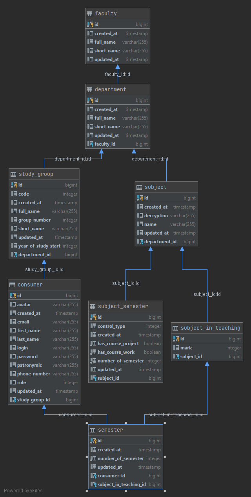
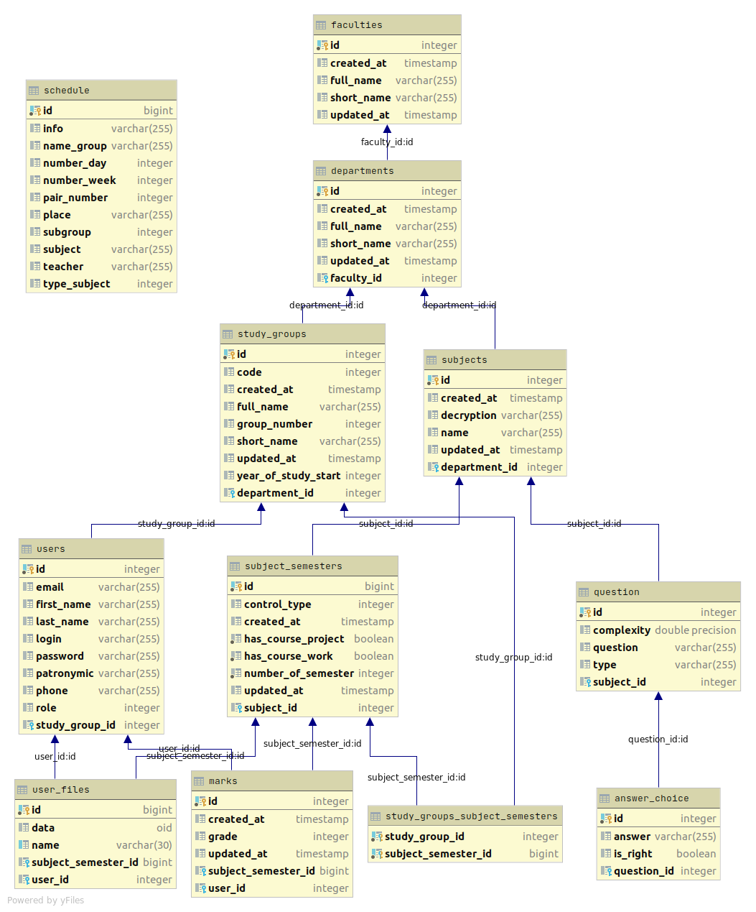

# База данных

У каждого пользователя (студента) есть его текущих актуальных семестр
По нему берутся из таблицы subject(в упрощенном случае, когда допускается, что все предметы односеместровые) 
или subject_semester(если вариант приближенном к реальному случаю, многосеместровые предметы) все предметы данного
семестра помещаеются в таблицу semester. Она описывает процесс обучения в одном отдельно взятом семестре по одному
отдельно взятому предмету (таблица портянка)

### dbScheme.png

### dbScheme2.png

### dbScheme3.png

